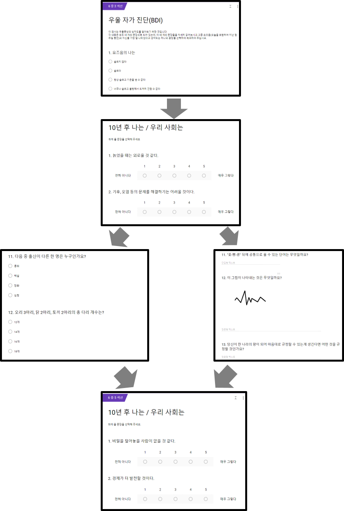
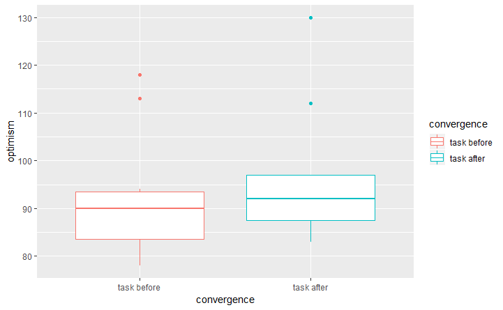
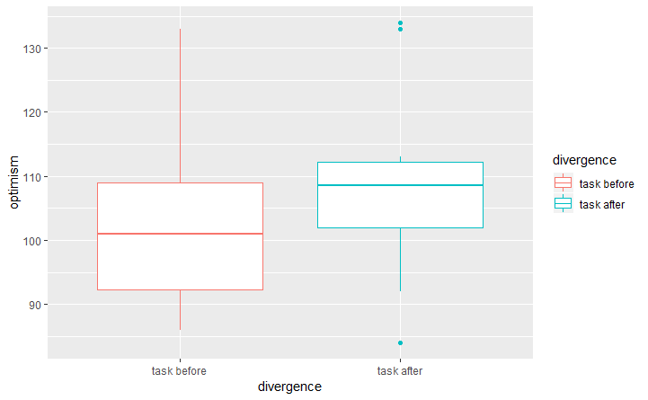

## 낙관 편향(Optimism Bias)

안녕하세요. 본 설문에 응해주셔서 감사합니다.  
응해 주신 분들에게 설문 내용에 대한 간략한 설명과 결과를 알려드리기 위해 문서를 공유합니다.  
간단한 결과 공유인 만큼 참고 문헌 및 인용에 대해서는 생략하겠습니다. 

본 과제 내용은 '낙관 편향'과 관련된 것이었습니다.  
미래에 대해 *'세상은 더 살기 좋아질 것이다'* 또는 *'내 미래는 좋아질 것이다'* 라고 생각하는 것을 낙관 편향이라고 하는데,  
연구된 것에 따르면 __나이가 어릴 수록__,  
또 경제가 호황인 경우, 특히 **남성** 에게서 낙관 편향이 강하게 나타나는 경향이 있으며,  
우울이나 불안 등의 정동 장애가 있는 경우, 낙관 편향의 효과가 없어진다고 알려져 있습니다. 

본 과제는 낙관 편향에 영향을 줄 수 있는 **_나이, 성별, 우울 정도_** 를 통제한 상태에서 사고 방식이 낙관 편향에 영향을 주는 지를 
알아보고자 하였습니다. 

설문에 응하신 분들은 두 종류 중 하나의 과제를 수행하셨습니다. 

과제 1은 __수렴적 사고(Convergent Thinking)__ 를 요구하는 정답이 있고 논리적 추론을 요구하는 과제였으며,  
예를 들면 25+32-11과 같은 간단한 산술 문제나, 삼단 논법과 같은 논리적 추론 문제 및 기준을 찾아 범주를 가리는 문제 등으로 구성되어 있습니다. 

과제 2는 __발산적 사고(Divergent Thinking)__ 를 요구하는 정답이 없고 가능한 자유로운 연상을 유도하는 과제로,  
사물의 용도를 다양하게 생각하거나, 당연히 알고 있는 것들에 대한 역발상 문제 등으로 구성되어 있습니다. 

수렴적 사고는 정답이 있고, 근거에 의한 사고 패턴을 형성하므로  
미래에 대한 막연한 낙관보다는 현실에 근거한 미래를 생각하도록 유도할 것이라 가정하였고,  
발산적 사고는 자유 연상에 의한 사고 패턴을 형성하므로 제약없는 사고 패턴이 낙관성에 정적인 영향을 줄 것이라 가정하였습니다. 

 

### 설문 과정 ###
 

### 1. 참여자: ###
* Convergence Task Group (총 25명 참여, 남자 제거, BDI 우울지수 10점 초과 제거, n=12)  
* Diverence Task Group (총 18명 참여, 남자 제거, BDI 우울 지수 10점 초과 제거, n=12) 
* 성별은 모두 여성
* 나이 (con_m=47, div_m=43, t(16)= 1.53, p > .14) --- 나이 차이 없음  
* 우울 지수 (con_m=5.5, div_m=5.3, t(18) = 0.09, p >.9) --- 우울 성향 차이 없음 

 
 

### 2. 과제 및 문항 구성 ###
설문은 
1. 미래에 대한 인식 30문항 (자신의 미래에 대한 인식 18, 인류 및 사회의 미래에 대한 인식 12)
2. 과제 수행 (수렴 및 발산 과제 각 15문항)
3. 미래에 대한 인식 30문항 (자신의 미래에 대한 인식 19, 인류 및 사회의 미래에 대한 인식 11)
으로 구성되어 있습니다. 

각 설문은 긍정형의 질문과 부정형의 질문으로 되어 있으며,  
부정형의 질문은 역으로 계산하여,  
총 점수가 높을수록 낙관 편향의 정도가 강함을 나타내도록 하였습니다. (총점 = 150) 

 
 

### 3. 결과 ###

#### 3-1. 과제 수행 전 낙관 정도 비교 ####

과제 수행 전 두 그룹의 낙관 편향 정도에는 유의미한 차이가 __없습니다__ (p >.08) 

 
 

#### 3-2. 수렴적 사고(Convergence Task) 과제를 한 그룹의 전 후 비교입니다. ####

과제 수행 전 후로 큰 차이가 __없습니다__ (t(10)=-1.77, p=.1) 

 
 

#### 3-3. 발산적 사고(Divergence Task) 과제를 한 그룹의 전 후 비교입니다. ####

과제 수행 전 후에 낙관 점수가 __상승__ 한 것을 알 수 있습니다 (t(11)=-2.33, p=.039)

 
 
 

### 4. 해석 ### 

가설과 같이 __'발산적 사고'__ 가 미래에 대해 낙관적인 생각을 하는데 영향을 줄 수 있다고 생각해 볼 수 있겠습니다.  
그러나 그래프에 나타난 것과 같이,  
낙관의 정도에 대한 점수가 높아진 것이 아니라,  
**부정적인 인식의 정도가 감소** 하는 방향으로 낙관 편향이 일어났음을 알 수 있습니다. 

 
 
 

### 5. 맺음말 ###

본 분석은 뼈대는 되지만 간략한 결과입니다.  
EDA를 해 본 결과, 우울 지수가 높은 분들과 우울 지수가 낮은 분들 사이에 큰 차이는 보이지 않았습니다만,  
전반적으로 우울 지수가 높은 분들이 (당연하게도) 낙관 점수는 낮았습니다.  

또 개인의 미래에 대한 인식과 공공의 미래에 대한 인식을 비교한 결과,  
개인의 미래에 대한 낙관 편향이 좀 더 우세하였지만, 추가적인 분석이 필요하여 결과에는 넣지 않았음을 알려드립니다.  
 
 
덕분에 과제를 수월하게 마칠 수 있었습니다.  
참여해 주셔서 다시 한 번 감사드립니다! 
 

혹시 의견이 있으시면 knownkwon@gmail.com으로 보내주세요!

 

