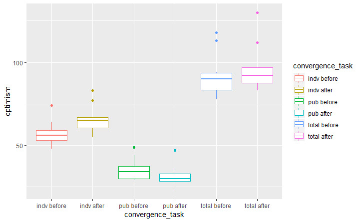
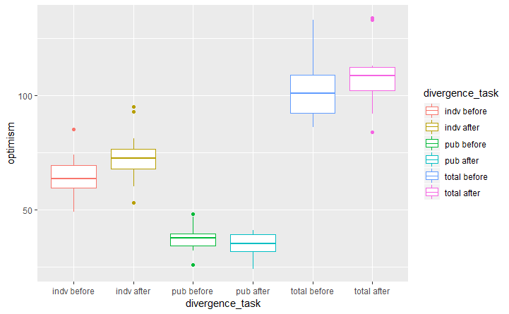

## 낙관 편향(Optimism Bias)
 

### 1. 도입 ###

__낙관 편향__: 미래에 대해 *'세상은 더 살기 좋아질 것이다'* 또는 *'내 미래는 좋아질 것이다'* 라고 생각하는 것  

 
현재까지 연구된 것에 따르면,   
*나이가 어릴 수록,*  
또 경제가 호황인 경우, 특히 *남성* 에게서 낙관 편향이 강하게 나타나는 경향이 있으며,  
우울이나 불안 등의 정동 장애가 있는 경우, 낙관 편향의 효과가 없어진다고 알려져 있음.

본 과제는 낙관 편향에 영향을 줄 수 있는 **_나이, 성별, 우울 정도_** 를 통제한 상태에서 사고 패턴이 낙관 편향에 영향을 주는 지를 알아보고자 함.  

__사고 패턴__

* 수렴적 사고(Convergent Thinking)  
수렴적 사고: 요구하는 정답이 있고 논리적 추론을 요구하는 과제를 행하면서 나타나는 사고 패턴  

* 발산적 사고(Divergent Thinking)  
발산적 사고: 논리적이기 보다는 자유 연상에 가까우며, 형식에 구애받지 않는 사고 패턴. 창의력 질문 등에서 사용됨  
 

**_연구 가설_**  
수렴적 사고는 정답이 있고, 근거에 의한 사고 패턴을 형성하므로  
미래에 대한 막연한 낙관보다는 현실에 근거한 미래를 생각하도록 유도할 것이라 가정하였고,  
발산적 사고는 자유 연상에 의한 사고 패턴을 형성하므로 제약없는 사고 패턴이 낙관성에 정적인 영향을 줄 것이라 가정함 

 

### 2. 연구 방법 ### 
 
### 2-1. 참여자 ### 

 
* 온라인 게시판, 트위터, 지인에게 직접 링크 공유하는 방식으로 온라인 설문 실시  
* Convergence Task Group (총 25명 참여, 남자 제거, BDI 우울지수 10점 초과 제거, n=12)  
* Diverence Task Group (총 18명 참여, 남자 제거, BDI 우울 지수 10점 초과 제거, n=12) 
* 성별은 모두 여성
* 나이 (con_m=47, div_m=43, t(16)= 1.53, p > .14) --- 나이 차이 없음  
* 우울 지수 (con_m=5.5, div_m=5.3, t(18) = 0.09, p >.9) --- 우울 성향 차이 없음 

 
 

### 2-2. 과제 및 문항 구성 ###

설문은 나이와 성별 입력을 시작으로,  
1. 미래에 대한 인식 30문항 (자신의 미래에 대한 인식 18, 인류 및 사회의 미래에 대한 인식 12)  
2. 과제 수행 (수렴 및 발산 과제 각 15문항)  
3. 미래에 대한 인식 30문항 (자신의 미래에 대한 인식 19, 인류 및 사회의 미래에 대한 인식 11)  
으로 구성.  
 
- 우울증 점수는 BDI (Beck's Depression Inventory) 한국어판을 사용하였으며,  
- 미래 인식에 대한 설문은 Miranda Æ Mennin (2007)을 참고하여 설문 사항을 추가하여 구성함   

- 수렴적 사고 과제:  
25+32-11과 같은 간단한 산술 문제나, 삼단 논법과 같은 논리적 추론 문제 및 기준을 찾아 범주를 가리는 문제 등으로 구성  
- 발산적 사고 과제:  
정답이 없고 가능한 자유로운 연상을 유도하는 과제로,  
사물의 용도를 다양하게 생각하거나, 당연히 알고 있는 것들에 대한 역발상 문제 등으로 구성 
 

각 설문은 긍정형의 질문과 부정형의 질문으로 되어 있으며,  
부정형의 질문은 역으로 계산하여,  
총 점수가 높을수록 낙관 편향의 정도가 강함을 나타내도록 함. (총점 = 150) 

 
 
### 2-3. 연구 과정 ### 

 
 
- 위와 같은 과정으로 설문 자료를 모은 후, independent sample t-test 및 paired t-test를 통해 검정함  
 
 

### 3. 결과 ###
 

| 과제 그룹 | 성별 | 나이(sd) | 우울 지수(sd) | 개인 미래 낙관 전후(p) | 공공 미래 낙관 전후(p) | 미래 낙관 전후(p)
|---|:---:|---:|---|:---:|---:|---:|
| 수렴 | 여성 | 47.8(4.7) | 5.45(3.6) | 0.000518*** | 0.00315** | 0.1076 |
| 발산 | 여성 | 43(9.7) | 5.3(2.7) | 0.0007939*** | 0.1475 | 0.03999* |

 
 
 

#### 3-1. 과제 수행 전 낙관 정도 비교 ####
##### 3-1-1. 미래에 대한 인식(total optimism score) 비교 #### 

- 과제 수행 전 두 그룹의 낙관 편향 정도에는 유의미한 차이가 __없음__ (p >.08).

 
 

#### 3-1-2. 수렴적 사고(Convergence Task) 과제를 한 그룹의 전 후 비교 ####

- 과제 수행 전 후로 큰 차이가 __없음__ (t(10)=-1.77, p=.1) 

 
 

#### 3-1-3. 발산적 사고(Divergence Task) 과제를 한 그룹의 전 후 비교입니다. ####

- 과제 수행 전 후에 낙관 점수가 __상승__ 한 것을 알 수 있음 (t(11)=-2.33, p=.039)

 
 
 

### 3-1-4. 해석 ### 

가설과 같이 __'발산적 사고'__ 가 미래에 대해 낙관적인 생각을 하는데 영향을 줄 수 있다고 생각해 볼 수 있겠습니다.  
그러나 그래프에 나타난 것과 같이,  
낙관의 정도에 대한 점수가 높아진 것이 아니라,  
**부정적인 인식의 정도가 감소** 하는 방향으로 낙관 편향이 일어났음을 알 수 있습니다. 

 
 
 

### 3-2. 세부 분석 및 논의 ###

개인의 미래에 대한 낙관 편향 점수의 변화와 공공의 미래에 대한 낙관 편향 점부 변화를 분석  

#### 3-2-1. ####

수렴적 사고 과제를 수행한 그룹의 경우,  
개인의 낙관 편향이 증가하였다 (t(20)=-2.1, P = .049)  
만약 과제를 수행하는 과정이 참여자들의 낙관도에 영향을 주었다면,  
이는 과제 문항의 용이성이 참여자의 자기효능감에 영향을 주었기 때문인 것으로 가정해 볼 수 있다. (br>

 

